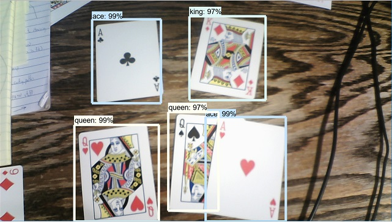
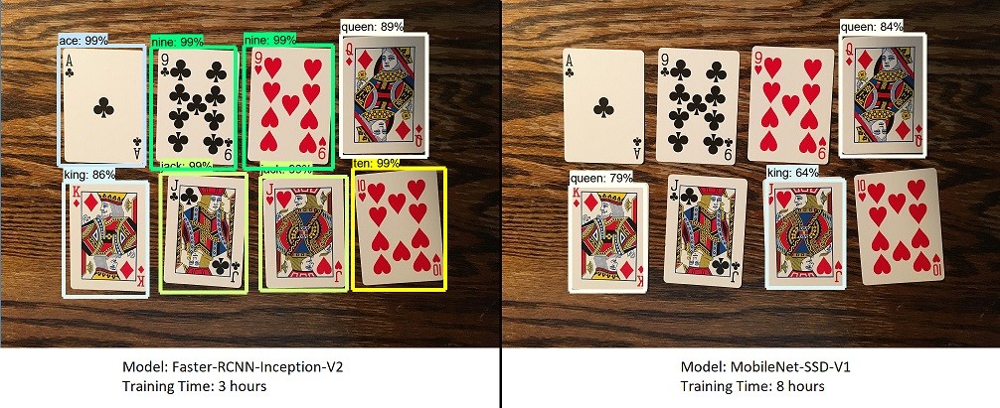
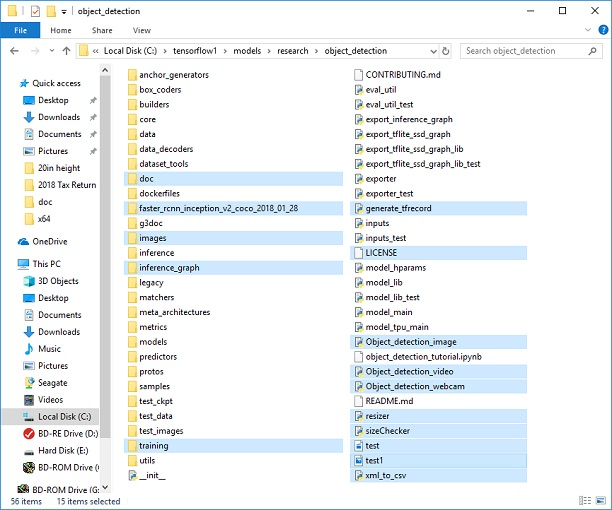
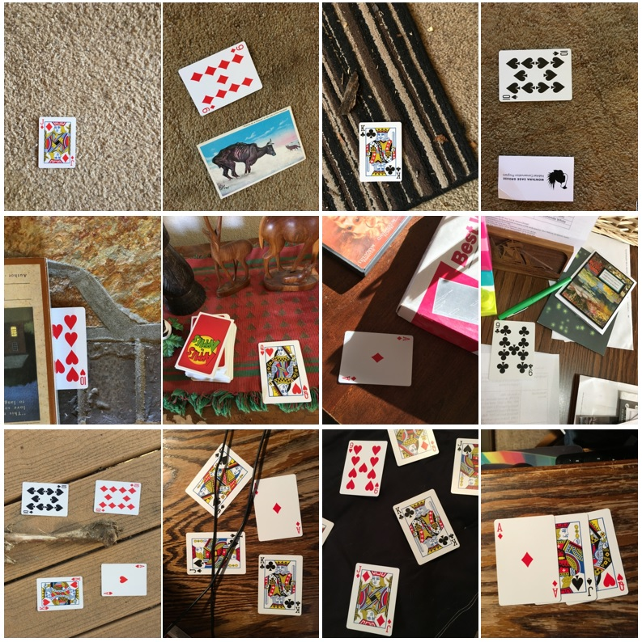
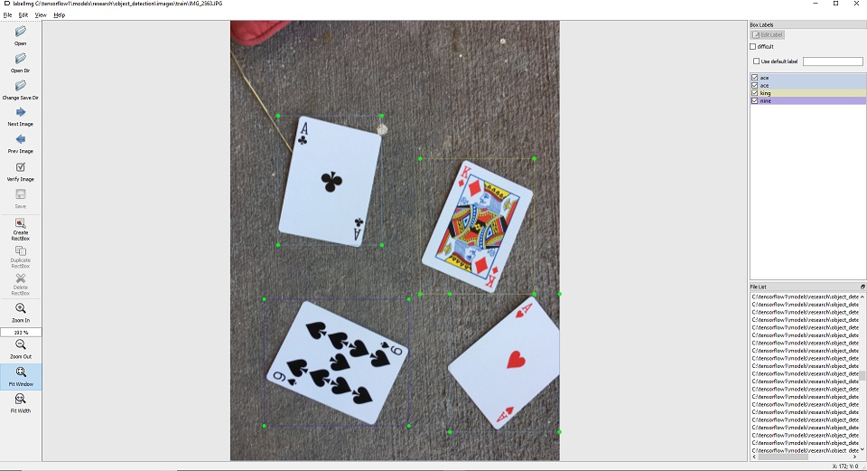
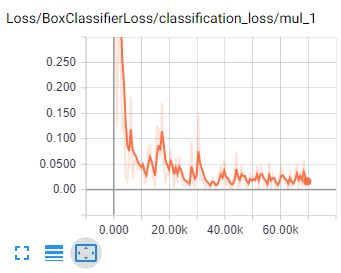
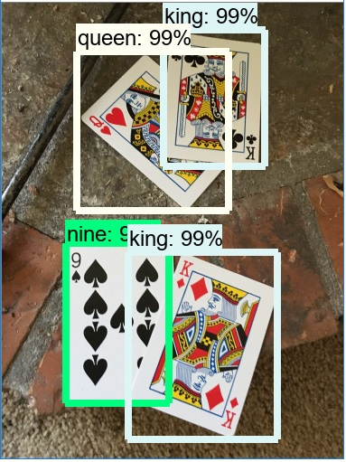

# 如何在Windows10 Tensorflow（GPU）环境下训练多对象检测分类模型

## 小结
*最近更新: 6/22/2019 with TensorFlow v1.13.1*

*本文的韩语翻译版本[translate folder](https://github.com/EdjeElectronics/TensorFlow-Object-Detection-API-Tutorial-Train-Multiple-Objects-Windows-10/blob/master/translate/README.md) (thanks @cocopambag!). 如果你打算翻译为其他语音，请随意！可以提交推送请求，作者将进行合并*

本库是一个教程，讲解如何在Windows10、8或7下，使用Tensorflow的对象检测API来训练多对象检测的分类器。(稍作修改即可用于Linux系统.) 最初使用的是Tensorflow1.5版本，但也会兼容最新的TensorFlow版本.

YouTubo上同时也发布了一个视频. 视频和本文的任何差异都是由于更新TensorFlow新版本导致的. 

**如果视频和文档不一致，请遵从文档!**

[](https://www.youtube.com/watch?v=Rgpfk6eYxJA)

本文描述了训练自己的对象检测分类器的所有步骤：: 
1. [安装 Anaconda, CUDA, 和 cuDNN](https://github.com/EdjeElectronics/TensorFlow-Object-Detection-API-Tutorial-Train-Multiple-Objects-Windows-10#1-install-anaconda-cuda-and-cudnn)
2. [建立对象检测目录结构和Anaconda虚拟环境（Virtual Environment）](https://github.com/EdjeElectronics/TensorFlow-Object-Detection-API-Tutorial-Train-Multiple-Objects-Windows-10#2-set-up-tensorflow-directory-and-anaconda-virtual-environment)
3. [收集和标注图像](https://github.com/EdjeElectronics/TensorFlow-Object-Detection-API-Tutorial-Train-Multiple-Objects-Windows-10#3-gather-and-label-pictures)
4. [生成训练数据](https://github.com/EdjeElectronics/TensorFlow-Object-Detection-API-Tutorial-Train-Multiple-Objects-Windows-10#4-generate-training-data)
5. [生成标签映射和训练配置文件](https://github.com/EdjeElectronics/TensorFlow-Object-Detection-API-Tutorial-Train-Multiple-Objects-Windows-10#5-create-label-map-and-configure-training)
6. [训练](https://github.com/EdjeElectronics/TensorFlow-Object-Detection-API-Tutorial-Train-Multiple-Objects-Windows-10#6-run-the-training)
7. [导出inference graph](https://github.com/EdjeElectronics/TensorFlow-Object-Detection-API-Tutorial-Train-Multiple-Objects-Windows-10#7-export-inference-graph)
8. [测试、使用新训练的对象检测分类器](https://github.com/EdjeElectronics/TensorFlow-Object-Detection-API-Tutorial-Train-Multiple-Objects-Windows-10#8-use-your-newly-trained-object-detection-classifier)

[附录: 常见错误](https://github.com/EdjeElectronics/TensorFlow-Object-Detection-API-Tutorial-Train-Multiple-Objects-Windows-10#appendix-common-errors)

本库提供了训练Pinochle Deck纸牌检测所有的文件，但只能检测9、10、J、Q、K、A。本文讲述如何替换这些文件来训练你心仪的监测分类器。同时提供了一个Python脚本在图像、视频或webcam上测试自训练的分类器。

<p align="center">
  
</p>

## 简介
本教程的目的是阐述如何训练卷积神经网络的多对象检测分类器。在本教程最后，将提供一个程序，在图像、视频或Webcam上识别对象并绘制矩形框进行标注对象。

有很多教程讲述如何使用TensorFlow对象检测API训练单对象分类器。然而，大多都是在Linux系统下进行操作的。如果只是为了训练分类器就要在高显卡配置的游戏PC上安装Linux，还是很不情愿的。对象检测API是在Linux系统上开发的。要在Windows上安装TensorFlow训练模型，有几个额外的工作需要处理，解决几个只能在Linux下运行的命令行问题。同时，本教程提供一个多分类对象检测器，而不是一个分类。

本教程基于Windows10,同时也兼任Windows7和8。这些过程也适用于Linux系统，但需相应的调整文件路径和包安装命令。在写本教程的时候使用TensorFlow-GPU1.5（现在已经升级为1.12.0），但会对新版本的TensorFlow兼容。

TensorFlow-GPU可以使用PC机的显卡处理训练中的额外任务，因此本教程将采用这个版本。测试发现，使用TensorFlow-GPU替代通用的TensorFlow，可以减少8倍的训练时间（从24小时缩减到3小时）。本教程也可以使用CPU版本的TensorFlow，但运行时间会很长。如果你要采用CPU版本的TensorFlow，可以忽略步骤1的安装CUDA和cuDNN。

## 步骤
### 1. 安装 Anaconda, CUDA, 和 cuDNN
视频 [this YouTube video by Mark Jay](https://www.youtube.com/watch?v=RplXYjxgZbw), 讲述了Anaconda、CUDA、粗DNN的安装过程。TensorFlow的安装推迟到步骤2进行。视频中使用的TensorFlow-GPU1.4，这里下载最新的TensorFlow版本对应的CUDA 和 cuDNN，即CUDA8.0，而不是视频中的6.0（升级后下载TensorFlow-GPU==1.12.0、CUDA9.0）。[TensorFlow website](https://www.tensorflow.org/install/gpu) 描述了TensorFlow版本对应的CUDA和cuDNN版本. 

如果使用的是旧版TensorFlow，请确保下载与之兼容的CUDA和cuDNN。[Here](https://www.tensorflow.org/install/source#tested_build_configurations)罗列出了TensorFlow版本需要的CUDA和cuDNN.

按视频要求安装[Anaconda](https://www.anaconda.com/distribution/#download-section),本教程后续部分将使用Anaconda的虚拟环境。(注意: 当前Anaconda版本使用的是Python3.7，还没有得到TensorFlow的官方支持。在步骤2创建Anaconda虚拟环境时，指定Python3.5)

更多安装细节见[TensorFlow's website](https://www.tensorflow.org/install),保护如何在其他操作系统（如Linux）上进行安装的步骤。[object detection repository](https://github.com/tensorflow/models/tree/master/research/object_detection) 也有安装指导 [installation instructions](https://github.com/tensorflow/models/blob/master/research/object_detection/g3doc/installation.md).

### 2. 配置TensorFlow目录和Anaconda虚拟环境
The TensorFlow Object Detection API requires using the specific directory structure provided in its GitHub repository. It also requires several additional Python packages, specific additions to the PATH and PYTHONPATH variables, and a few extra setup commands to get everything set up to run or train an object detection model. 

This portion of the tutorial goes over the full set up required. It is fairly meticulous, but follow the instructions closely, because improper setup can cause unwieldy errors down the road.

#### 2a. Download TensorFlow Object Detection API repository from GitHub
Create a folder directly in C: and name it “tensorflow1”. This working directory will contain the full TensorFlow object detection framework, as well as your training images, training data, trained classifier, configuration files, and everything else needed for the object detection classifier.

Download the full TensorFlow object detection repository located at https://github.com/tensorflow/models by clicking the “Clone or Download” button and downloading the zip file. Open the downloaded zip file and extract the “models-master” folder directly into the C:\tensorflow1 directory you just created. Rename “models-master” to just “models”.

**Note: The TensorFlow models repository's code (which contains the object detection API) is continuously updated by the developers. Sometimes they make changes that break functionality with old versions of TensorFlow. It is always best to use the latest version of TensorFlow and download the latest models repository. If you are not using the latest version, clone or download the commit for the version you are using as listed in the table below.**

 If you are using an older version of TensorFlow, here is a table showing which GitHub commit of the repository you should use. I generated this by going to the release branches for the models repository and getting the commit before the last commit for the branch. (They remove the research folder as the last commit before they create the official version release.)

| TensorFlow version | GitHub Models Repository Commit |
|--------------------|---------------------------------|
|TF v1.7             |https://github.com/tensorflow/models/tree/adfd5a3aca41638aa9fb297c5095f33d64446d8f |
|TF v1.8             |https://github.com/tensorflow/models/tree/abd504235f3c2eed891571d62f0a424e54a2dabc |
|TF v1.9             |https://github.com/tensorflow/models/tree/d530ac540b0103caa194b4824af353f1b073553b |
|TF v1.10            |https://github.com/tensorflow/models/tree/b07b494e3514553633b132178b4c448f994d59df |
|TF v1.11            |https://github.com/tensorflow/models/tree/23b5b4227dfa1b23d7c21f0dfaf0951b16671f43 |
|TF v1.12            |https://github.com/tensorflow/models/tree/r1.12.0 |
|TF v1.13            |https://github.com/tensorflow/models/tree/r1.13.0 |
|Latest version      |https://github.com/tensorflow/models |

This tutorial was originally done using TensorFlow v1.5 and this [GitHub commit](https://github.com/tensorflow/models/tree/079d67d9a0b3407e8d074a200780f3835413ef99) of the TensorFlow Object Detection API. If portions of this tutorial do not work, it may be necessary to install TensorFlow v1.5 and use this exact commit rather than the most up-to-date version.

#### 2b. Download the Faster-RCNN-Inception-V2-COCO model from TensorFlow's model zoo
TensorFlow provides several object detection models (pre-trained classifiers with specific neural network architectures) in its [model zoo](https://github.com/tensorflow/models/blob/master/research/object_detection/g3doc/detection_model_zoo.md). Some models (such as the SSD-MobileNet model) have an architecture that allows for faster detection but with less accuracy, while some models (such as the Faster-RCNN model) give slower detection but with more accuracy. I initially started with the SSD-MobileNet-V1 model, but it didn’t do a very good job identifying the cards in my images. I re-trained my detector on the Faster-RCNN-Inception-V2 model, and the detection worked considerably better, but with a noticeably slower speed.

<p align="center">
  
</p>

You can choose which model to train your objection detection classifier on. If you are planning on using the object detector on a device with low computational power (such as a smart phone or Raspberry Pi), use the SDD-MobileNet model. If you will be running your detector on a decently powered laptop or desktop PC, use one of the RCNN models. 

本教程中使用Faster-RCNN-Inception-V2模型. [点击下载.](http://download.tensorflow.org/models/object_detection/faster_rcnn_inception_v2_coco_2018_01_28.tar.gz) 解压下载后的文件 faster_rcnn_inception_v2_coco_2018_01_28.tar.gz到faster_rcnn_inception_v2_coco_2018_01_28目录，拷贝到C:\tensorflow1\models\research\object_detection目录. (注意: 模型数据和版本以后会发生变化，但对本教程仍然有效.)

#### 2c. 从GitHub上下载本教程的代码库
下载本页所在库的全部内容（移动到顶端点击Close or Download按钮），直接将所有内容解压到C:\tensorflow1\models\research\object_detection目录。（覆盖已存在的“README.md”文件。）这里创建的特殊目录结构将在本教程后续步骤中使用。 

至此，\object_detection目录如下图所示:

<p align="center">
  
</p>

这个代码库包括图像、标记数据、.csv文件和训练纸牌分类器需要的TFRecords。可以使用这些图像和数据练习训练自己的纸牌检测器。同时包括生成训练数据的Python脚本。以及在图像、视频、Webcam上测试对象检测分类器的脚本。可以忽略\doc目录及其中的文件；这些文件只用于本readme页面。

如果你要练习训练自己的纸牌分类器，可以保留全部文件。教程后面部分将看到如何生成这些文件、进行训练。还需要生成TFRecord文件（train.record和test.record）,见步骤4.

也可以下载作者训练纸牌检测器的frozen inference graph [from this Dropbox link]
(https://www.dropbox.com/s/va9ob6wcucusse1/inference_graph.zip?dl=0) 并解压到\object_detection\inference_graph. 这个逻辑图开箱即用。在配置指令步骤2a-2f完成后，就可以使用Object_detection_image.py (or video or webcam)脚本进行测试。

如果要训练自己的对象检测器，删除如下目录中的文件（不删除目录）：
- \object_detection\images\train 和 \object_detection\images\test 中的所有文件
- \object_detection\images 目录下的“test_labels.csv” 和 “train_labels.csv”文件
- \object_detection\training下的所有文件
-	\object_detection\inference_graph下的所有文件

现在，就可以从零开始训练自己的对象检测器了。本教程假设上面提到的所有文件都被删除，并讲解如何基于自己的训练数据生成这些文件。

#### 2d. 设置新的Anaconda虚拟环境
下一步，在Anaconda下为tensorflow-gpu配置虚拟环境。在windows开始菜单，找到Anaconda prompt工具，右键，点击“以管理员身份运行”。如果提示是否允许运行，点击Yes。

在弹出的命令行终端，使用下面的命令，创建新的虚拟环境tensorflow1：

```
C:\> conda create -n tensorflow1 pip python=3.5
```
然后激活环境（如果使用Windows PowerShell可能激活失败，需要安装一个三方包让Windows PowerShell支持conda命令。[详见](https://blog.csdn.net/qq_38163755/article/details/88144767))，升级pip:
```
C:\> activate tensorflow1

(tensorflow1) C:\>python -m pip install --upgrade pip
```
在环境下安装tensorflow-gpu（安装1.5.0版本）:
```
(tensorflow1) C:\> pip install --ignore-installed --upgrade tensorflow-gpu
```

(注意: 也可以安装只针对CPU的TensorFlow，但运行较慢。如果要使用CPU版本，在上面的命令行中使用tensorflow替代tensorflow-gpu.)

使用如下命令安装其他必要的包:
```
(tensorflow1) C:\> conda install -c anaconda protobuf
(tensorflow1) C:\> pip install pillow
(tensorflow1) C:\> pip install lxml
(tensorflow1) C:\> pip install Cython
(tensorflow1) C:\> pip install contextlib2
(tensorflow1) C:\> pip install jupyter
(tensorflow1) C:\> pip install matplotlib
(tensorflow1) C:\> pip install pandas
(tensorflow1) C:\> pip install opencv-python
```
(注意: Tensorflow不需要‘pandas’ 和 ‘opencv-python’包,但他们在生成TFRecords和图像、视频、Webcam验证脚本中被引用.)

#### 2e. 配置PYTHONPATH环境变量
A PYTHONPATH variable must be created that points to the \models, \models\research, and \models\research\slim directories. Do this by issuing the following commands (from any directory):
```
(tensorflow1) C:\> set PYTHONPATH=C:\tensorflow1\models;C:\tensorflow1\models\research;C:\tensorflow1\models\research\slim
```
(Note: Every time the "tensorflow1" virtual environment is exited, the PYTHONPATH variable is reset and needs to be set up again. You can use "echo %PYTHONPATH% to see if it has been set or not.)

#### 2f. 编译Protobufs，运行setup.py
接下来，编译Protobuf文件，TensorFlow利用生成的代码配置模型和训练参数。不幸的是，TensorFlow对象检测API[installation page](https://github.com/tensorflow/models/blob/master/research/object_detection/g3doc/installation.md)自带的编译命令protoc在windows上无法使用。\object_detection\protos目录下的所有.proto文件都必须单独使用命令行编译。

在Anaconda命令行工具中，进入\models\research目录：
```
(tensorflow1) C:\> cd C:\tensorflow1\models\research
```

将下面的命令拷贝到命令行中，按回车:
```
protoc --python_out=. .\object_detection\protos\anchor_generator.proto .\object_detection\protos\argmax_matcher.proto .\object_detection\protos\bipartite_matcher.proto .\object_detection\protos\box_coder.proto .\object_detection\protos\box_predictor.proto .\object_detection\protos\eval.proto .\object_detection\protos\faster_rcnn.proto .\object_detection\protos\faster_rcnn_box_coder.proto .\object_detection\protos\grid_anchor_generator.proto .\object_detection\protos\hyperparams.proto .\object_detection\protos\image_resizer.proto .\object_detection\protos\input_reader.proto .\object_detection\protos\losses.proto .\object_detection\protos\matcher.proto .\object_detection\protos\mean_stddev_box_coder.proto .\object_detection\protos\model.proto .\object_detection\protos\optimizer.proto .\object_detection\protos\pipeline.proto .\object_detection\protos\post_processing.proto .\object_detection\protos\preprocessor.proto .\object_detection\protos\region_similarity_calculator.proto .\object_detection\protos\square_box_coder.proto .\object_detection\protos\ssd.proto .\object_detection\protos\ssd_anchor_generator.proto .\object_detection\protos\string_int_label_map.proto .\object_detection\protos\train.proto .\object_detection\protos\keypoint_box_coder.proto .\object_detection\protos\multiscale_anchor_generator.proto .\object_detection\protos\graph_rewriter.proto .\object_detection\protos\calibration.proto .\object_detection\protos\flexible_grid_anchor_generator.proto
```
将为\object_detection\protos目录下的每个.proto文件生成一个name_pb2.py文件。

**(注意: TensorFlow可能会在\protos目录下添加新的.proto文件。如果看到错误信息提示ImportError: cannot import name 'something_something_pb2' , 则需要修改protoc命令包含新的.proto文件.)**

最后，在命令C:\tensorflow1\models\research中运行如下命令:
```
(tensorflow1) C:\tensorflow1\models\research> python setup.py build
(tensorflow1) C:\tensorflow1\models\research> python setup.py install
```

#### 2g. 测试TensorFlow安装确保正常运行
现在TensorFlow对象检测API已经配置完毕，可以用来迁移训练对象检测模型或训练全新的模型。在Jupyter中启动object_detection_tutorial.ipynb可以测试安装环境是否正确，并进行修正。在\object_detection目录，运行命令：
```
(tensorflow1) C:\tensorflow1\models\research\object_detection> jupyter notebook object_detection_tutorial.ipynb
```
在默认浏览器中打开脚本，允许你逐段运行代码。点击上方的工具栏中的Run按钮可以从头开始运行各段代码。当段落前面的标记“In [ * ]”中的出现一个数字，（“In [1]”），说明这个段落执行完毕。

(注意: 有段代码要从GitHub上下载ssd_mobilenet_v1模型, 大约74MB. 这段执行需要一定的时间，需要耐心.)

执行完所有的代码后，在最后一段代码下方可以看到两个带有标签的图像。如果看到这两张图片说明一切Ok！如果没有，最下方的段落会显示出错误信息。见[Appendix](https://github.com/EdjeElectronics/TensorFlow-Object-Detection-API-Tutorial-Train-Multiple-Objects-Windows-10#appendix-common-errors) 罗列出了可能遇到的错误.

**注意: 如果运行了Jupyter Notebook中的全部代码，没有任何错误,但标签图片还是没有出现, 检查一下: 在object_detection/utils/visualization_utils.py注释掉第29和30行的导入matplotlib的语句。在重新运行Jupyter notebook.**

<p align="center">
  
</p>

### 3. 收集和标记图像
现在TensorFlow对象检测API已经配置完毕，我们需要为训练新的检测分类器准备图像.

#### 3a. 收集图像
TensorFlow需要为每个对象准备几百张图像，才能训练出好的检测分类器。要训练健壮的分类器，训练数据中需要有期望的对象，同时还要有随机的其他对象，而且还要有不同的背景和光照条件。有些图像中，目标物体要被部分遮挡，或只在图片中显示一部分。

在我的纸牌检测分类器中，有六种不同的对象要进行检测（纸牌9、10、J、Q、K、A--没有检测花色，值检测大小）。使用IPhone手机对每张纸牌拍摄40张图片，在图片中同时还有其他非期望的对象。另外，还有100张图片有多张纸牌。我希望在纸牌被部分遮挡时也要能够检测，因此故意在一些图像上遮挡了纸牌。

<p align="center">
  
</p>

可以使用手机拍摄图片或从Google上搜索图片。推荐至少要有200张图片。我使用311张图片训练纸牌检测器。

确保图片不要太大。应该小于200KB，分辨率不高于720x1280。图像越大训练分类器时间越长。可以使用resize.py脚本缩小图片的尺寸。

处理完所有图片后，将20%的图片移动到\object_detection\images\test目录，80%的图片移动到\object_detection\images\train目录。确保在\test、\train目录中图片种类均匀分布。

#### 3b. 标记图片
这个部分很有趣！收集到所有图片后，就需要在每张图片上标记出目标对象了。LabelImg是标记图像的强大工具，GitHub上有详细的使用说明。

[LabelImg GitHub link](https://github.com/tzutalin/labelImg)

[LabelImg download link](https://www.dropbox.com/s/tq7zfrcwl44vxan/windows_v1.6.0.zip?dl=1)

下载并安装LabelImg，启动后打开\images\train目录，在每张图片上框出目标对象。在\images\test目录重复同样的过程。这需要一定的时间。

<p align="center">
  
</p>

LabelImg将图片中的标记数据保存到了.xml文件。使用这些.xml生成TFRecords，作为TensorFlow训练的一部分输入。在标记好图像数据后，\test和\train目录中的每个图像都有一个对应的.xml文件。

### 4. 生成训练数据
完成图像标记后，就可以生成用于TensorFlow训练模型的TRRecords输入数据了。本教程使用了xml_to_csv.py 和 generate_tfrecord.py 脚本，引用于[Dat Tran’s Raccoon Detector dataset](https://github.com/datitran/raccoon_dataset), 针对我们的目录结构做了稍许调整。

首先，利用图像的.xml文件创建包含所有训练和测试图像信息的.csv文件。在\object_detection 目录, 在Anaconda命令行工具中执行如下命令:
```
(tensorflow1) C:\tensorflow1\models\research\object_detection> python xml_to_csv.py
```
将在目录\object_detection\images下创建train_labels.csv 和 test_labels.csv 文件. 

接下来，在记事本中打开generate_tfrecord.py文件.在第31行将标记映射替换为你自己的标记映射，每个对象指定一个ID数字。在步骤5b中，将使用同样的ID数字配置labelmap.pbtxt文件。

例如，如果要训练篮球、衬衫、球鞋，需要调整generate_tfrecord.py:
```
# TO-DO replace this with label map
def class_text_to_int(row_label):
    if row_label == 'nine':
        return 1
    elif row_label == 'ten':
        return 2
    elif row_label == 'jack':
        return 3
    elif row_label == 'queen':
        return 4
    elif row_label == 'king':
        return 5
    elif row_label == 'ace':
        return 6
    else:
        None
```
为:
```
# TO-DO replace this with label map
def class_text_to_int(row_label):
    if row_label == 'basketball':
        return 1
    elif row_label == 'shirt':
        return 2
    elif row_label == 'shoe':
        return 3
    else:
        None
```
然后，在\object_detection目录下执行如下命令生成TFRecord文件:
```
python generate_tfrecord.py --csv_input=images\train_labels.csv --image_dir=images\train --output_path=train.record
python generate_tfrecord.py --csv_input=images\test_labels.csv --image_dir=images\test --output_path=test.record
```
在\object_detection目录下生成train.record和test.record文件，用于训练新的对象检测分类器。

### 5. 创建标签映射和训练配置
在开始训练之前，最后要做的事情是创建标签映射，修改训练配置文件。

#### 5a. 标签映射
标签映射告诉训练器我们关注的对象类型名称及其对应的ID编号。使用记事本创建新文件，保存为C:\tensorflow1\models\research\object_detection\training目录下的labelmap.pbtxt（注意后缀是.pbtxt而不是.txt）。在记事本中， 拷贝或按如下格式（纸牌识别器的标签 映射）录入标签映射。
:
```
item {
  id: 1
  name: 'nine'
}

item {
  id: 2
  name: 'ten'
}

item {
  id: 3
  name: 'jack'
}

item {
  id: 4
  name: 'queen'
}

item {
  id: 5
  name: 'king'
}

item {
  id: 6
  name: 'ace'
}
```
标签映射的ID编号必须与generate_tfrecord.py文件中的定义保持一致。对于篮球、T恤、球鞋的例子，labelmap.pbtxt应如下所示：
```
item {
  id: 1
  name: 'basketball'
}

item {
  id: 2
  name: 'shirt'
}

item {
  id: 3
  name: 'shoe'
}
```

#### 5b. 配置训练信息
最后，要配置目标检测训练管道。启动定义了训练使用的模型和参数。这是训练前的最后一个步骤。

移动到C:\tensorflow1\models\research\object_detection\samples\configs目录，将faster_rcnn_inception_v2_pets.config文件拷贝到\object_detection\training目录。使用记事本打开这个文件，需要对这个.config文件做几处修改，主要修改类别和样本的数量，以及训练数据的文件路径。

对faster_rcnn_inception_v2_pets.config文件做如下几处修改。注意：路径必须使用斜线（linux的分隔符）而不是反斜线，否则训练模型时TensorFlow将抛出路径错误信息！同样路径必须置于双引号内，而不是单引号。

- 第九9行. 修改num_classes为训练分类器中的对象类型数量. 上面篮球、T恤、球鞋的例子中，需要将num_classes指定为3.
- 第106行. 修改 fine_tune_checkpoint 为:
  - fine_tune_checkpoint : "C:/tensorflow1/models/research/object_detection/faster_rcnn_inception_v2_coco_2018_01_28/model.ckpt"

- 第 123 和 125行. 在train_input_reader 节, 修改 input_path 和 label_map_path :
  - input_path : "C:/tensorflow1/models/research/object_detection/train.record"
  - label_map_path: "C:/tensorflow1/models/research/object_detection/training/labelmap.pbtxt"

- 第 130行. 修改 num_examples为\images\test目录下的图像数量.

- 第 135 和 137行. 在eval_input_reader小结,修改input_path 和 label_map_path:
  - input_path : "C:/tensorflow1/models/research/object_detection/test.record"
  - label_map_path: "C:/tensorflow1/models/research/object_detection/training/labelmap.pbtxt"

修改后保存文件.就这样！训练的配置完成！

### 6. 执行训练
**UPDATE 9/26/18:** 
*在1.9版本, TensorFlow废弃了train.py，采用model_main.py文件。还无法使model_main.py文件正常运行（提示相关pycocotools错误）。幸运的是，可以在/object_detection/legacy目录中找到train.py文件。将train.py文件拷贝到/object_detection目录，继续下述过程。*

现在继续！在\object_detection目录,执行如下命令启动训练:
```
python train.py --logtostderr --train_dir=training/ --pipeline_config_path=training/faster_rcnn_inception_v2_pets.config
```
如果配置正确，TensorFlow将初始化训练过程。初始化需要约30秒，而后开始训练。开始训练输出如下图：

<p align="center">
  
</p>

每个训练步骤都会打印出loss。初始值很高，随着训练过程逐步降低。在使用Faster-RCNN-Inception-V2模型的训练中，这个值从3.0快速降到0.8。推荐将模型训练到loss低于0.05，需要大概4万步，约2个小时（依赖于CPU和GPU的性能）。注意：不同的模型loss的值会有差异。MobileNet-SSD模型loss起始值为20，需要将loss训练到低于2。

可以使用TensorBoard查看训练过程。打开Anaconda提示符工具，激活tensorflow1虚拟环境，导航到C:\tensorflow1\models\research\object_detection目录，输入如下命令：
```
(tensorflow1) C:\tensorflow1\models\research\object_detection>tensorboard --logdir=training
```
将创建一个本机的web页面，地址为YourPCName:6006，使用浏览器打开。TensorBoard页面提供了训练过程的信息和图示。最重要的是loss图表，其中显示了分类器训练过程中全部的loss值。

<p align="center">
  
</p>

训练例程每5分钟保存一次checkpoints。在命令行提示符窗口，按下Ctrl+C结束训练。应该在checkpoint保存后结束训练。可以在终止训练，随后在继续训练，将从最近保存的checkpoint恢复训练过程。最高步数的checkpoint将用于生成冻结图（frozen inference graph）。

### 7. 导出推理图
现在训练完成，最后步骤就是生成冻结图（.pb文件）。在\object_detection目录，执行如下命令，model.ckpt-XXXX中的XXXX要替换为training目录下.ckpt文件的最大编号：
```
python export_inference_graph.py --input_type image_tensor --pipeline_config_path training/faster_rcnn_inception_v2_pets.config --trained_checkpoint_prefix training/model.ckpt-XXXX --output_directory inference_graph
```
在\object_detection\inference_graph目录生成了一个frozen_inference_graph.pb文件。这个.pb文件包含了对象检测分类器。

### 8. 使用新训练出来的对象检测分类器!
对象检测分类器已经就位！我们已经编写了Python脚本在图像、视频、Webcam上测试模型。

在运行Python脚本之前，需要修改脚本中的NUM_CLASSES变量，置为你要检测的类型数量（对于纸牌范例，我们要检测6张纸牌，所以NUM_CLASSES = 6）。

要测试对象检测器，将含有一个或多个目标对象的图像移到\object_detection目录，修改Object_detection_image.py文件中的IMAGE_NAME变量为图片的文件名。也可以使用视频（运行Object_detection_video.py脚本），或使用Object_detection_webcam.py脚本检测USB webcam中的对象。

要运行脚本，在Anacoda命令行提示符下（激活tensorflow1虚拟环境）输入idle回车。打开IDLE，在其中打开脚本后运行。

如果运行正常，对象检测器初始化大约用10秒，而后显示图像检测结果窗口！

<p align="center">
  
</p>

如果发生错误，请检查附录：其中罗列了我遇到的运行对象检测分类器时遇到的问题。也可google这些错误。下面信息是Stack Exchange或TensorFlow GitHub网站上常见的问题。

## Appendix: Common Errors
It appears that the TensorFlow Object Detection API was developed on a Linux-based operating system, and most of the directions given by the documentation are for a Linux OS. Trying to get a Linux-developed software library to work on Windows can be challenging. There are many little snags that I ran in to while trying to set up tensorflow-gpu to train an object detection classifier on Windows 10. This Appendix is a list of errors I ran in to, and their resolutions.

#### 1. ModuleNotFoundError: No module named 'deployment' or No module named 'nets'

This error occurs when you try to run object_detection_tutorial.ipynb or train.py and you don’t have the PATH and PYTHONPATH environment variables set up correctly. Exit the virtual environment by closing and re-opening the Anaconda Prompt window. Then, issue “activate tensorflow1” to re-enter the environment, and then issue the commands given in Step 2e. 

You can use “echo %PATH%” and “echo %PYTHONPATH%” to check the environment variables and make sure they are set up correctly.

Also, make sure you have run these commands from the \models\research directory:
```
setup.py build
setup.py install
```

#### 2. ImportError: cannot import name 'preprocessor_pb2'

#### ImportError: cannot import name 'string_int_label_map_pb2'

#### (or similar errors with other pb2 files)

This occurs when the protobuf files (in this case, preprocessor.proto) have not been compiled. Re-run the protoc command given in Step 2f. Check the \object_detection\protos folder to make sure there is a name_pb2.py file for every name.proto file.

#### 3. object_detection/protos/.proto: No such file or directory

This occurs when you try to run the
```
“protoc object_detection/protos/*.proto --python_out=.”
```
command given on the TensorFlow Object Detection API installation page. Sorry, it doesn’t work on Windows! Copy and paste the full command given in Step 2f instead. There’s probably a more graceful way to do it, but I don’t know what it is.

#### 4. Unsuccessful TensorSliceReader constructor: Failed to get "file path" … The filename, directory name, or volume label syntax is incorrect.
  
This error occurs when the filepaths in the training configuration file (faster_rcnn_inception_v2_pets.config or similar) have not been entered with backslashes instead of forward slashes. Open the .config file and make sure all file paths are given in the following format:
```
“C:/path/to/model.file”
```

#### 5. ValueError: Tried to convert 't' to a tensor and failed. Error: Argument must be a dense tensor: range(0, 3) - got shape [3], but wanted [].

The issue is with models/research/object_detection/utils/learning_schedules.py Currently it is
```
rate_index = tf.reduce_max(tf.where(tf.greater_equal(global_step, boundaries),
                                      range(num_boundaries),
                                      [0] * num_boundaries))
```
Wrap list() around the range() like this:

```
rate_index = tf.reduce_max(tf.where(tf.greater_equal(global_step, boundaries),
                                     list(range(num_boundaries)),
                                      [0] * num_boundaries))
```

[Ref: Tensorflow Issue#3705](https://github.com/tensorflow/models/issues/3705#issuecomment-375563179)

#### 6. ImportError: DLL load failed: The specified procedure could not be found.   (or other DLL-related errors)
This error occurs because the CUDA and cuDNN versions you have installed are not compatible with the version of TensorFlow you are using. The easiest way to resolve this error is to use Anaconda's cudatoolkit package rather than manually installing CUDA and cuDNN. If you ran into these errors, try creating a new Anaconda virtual environment:
```
conda create -n tensorflow2 pip python=3.5
```
Then, once inside the environment, install TensorFlow using CONDA rather than PIP:
```
conda install tensorflow-gpu
```
Then restart this guide from Step 2 (but you can skip the part where you install TensorFlow in Step 2d).

#### 7. In Step 2g, the Jupyter Notebook runs all the way through with no errors, but no pictures are displayed at the end.
If you run the full Jupyter Notebook without getting any errors, but the labeled pictures still don't appear, try this: go in to object_detection/utils/visualization_utils.py and comment out the import statements around lines 29 and 30 that include matplotlib. Then, try re-running the Jupyter notebook. (The visualization_utils.py script changes quite a bit, so it might not be exactly line 29 and 30.)
